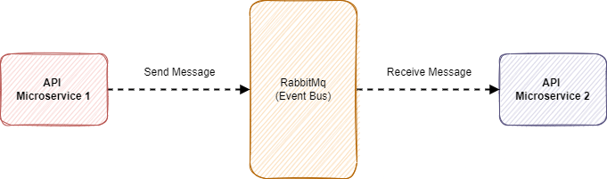

# Sample 01 - Event-Driven With a EventBus

This sample project aims to demonstrate the integration between one Microservices WebApi and a worker service, the first being the sender (producer) and the second the receiver (consumer), using RabbitMQ as EventBus.

RabbitMQ will receive, manage and send the message to a specific queue, where the worker will be waiting to receive.

